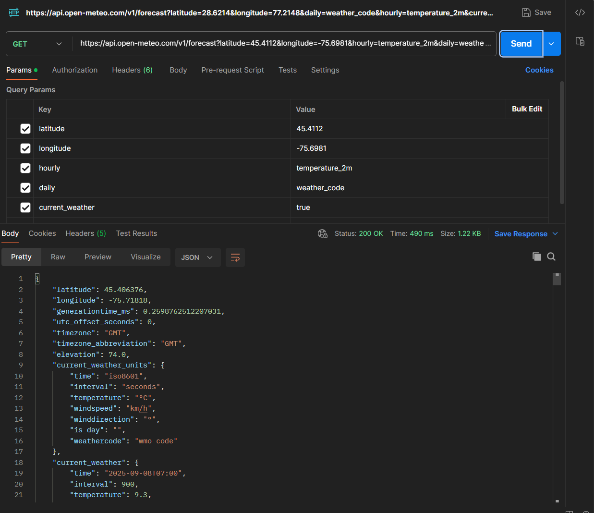

> **Title:** Open-Meteo API Documentation  
> **Author:** Saumil Khanna  
> **Last updated:** 2025-09-05  
> **Version:** 1.0 

# Open-Meteo API Documentation

## Overview
Open-Meteo is an open-source weather API that provides free forecast data without authentication.

## Authentication
No authentication required. Open-Meteo is an open-source API.


## Base URL
```
https://api.open-meteo.com/v1/forecast
```
## Endpoints 
### GET /forecast
Returns weather forecast data for a specified location.

## Parameters 

| Parameter | Required | Type | Example | Description |
|-----------|----------|------|---------|-------------|
| latitude  | Yes      | Decimal | 31.6223 | Latitude in decimal degrees (north = positive, south = negative). |
| longitude | Yes      | Decimal | 74.8753 | Longitude in decimal degrees (east = positive, west = negative). |
| hourly    | No       | String  | temperature_2m | Hourly variables (e.g., temperature, precipitation). |
| current_weather | No | Boolean | true | If true, returns the latest current weather conditions. |
| daily     | No       | String  | weather_code | Daily forecast variables (e.g., max/min temp, weather code). |
| timezone  | No       | String  | auto | Time zone for the response (use `auto` or specify manually). |


## Example Request/Response 

### Example: Berlin, Germany
- API Request : 
```bash
curl 'https://api.open-meteo.com/v1/forecast?latitude=52.52&longitude=13.41&hourly=temperature_2m&daily=weather_code&current_weather=true'
```
<details>
<summary>Click to expand full JSON Response</summary>

```JSON
{
    "latitude": 52.52,
    "longitude": 13.419998,
    "generationtime_ms": 0.10538101196289062,
    "utc_offset_seconds": 0,
    "timezone": "GMT",
    "timezone_abbreviation": "GMT",
    "elevation": 38.0,
    "current_weather_units": {
        "time": "iso8601",
        "interval": "seconds",
        "temperature": "°C",
        "windspeed": "km/h",
        "winddirection": "°",
        "is_day": "",
        "weathercode": "wmo code"
    },
    "current_weather": {
        "time": "2025-09-08T07:00",
        "interval": 900,
        "temperature": 15.6,
        "windspeed": 7.9,
        "winddirection": 87,
        "is_day": 1,
        "weathercode": 0
    },
    "hourly_units": {
        "time": "iso8601",
        "temperature_2m": "°C"
    },
    "hourly": {
        "time": [
            "2025-09-08T00:00",
            "2025-09-08T01:00",
            "2025-09-08T02:00",
            "2025-09-08T03:00",
            "2025-09-08T04:00",
            "2025-09-08T05:00",
            "2025-09-08T06:00",
            "2025-09-08T07:00",
            "2025-09-08T08:00",
            "2025-09-08T09:00",
            "2025-09-08T10:00",
            "2025-09-08T11:00",
            "2025-09-08T12:00",
            "2025-09-08T13:00",
            "2025-09-08T14:00",
            "2025-09-08T15:00",
            "2025-09-08T16:00",
            "2025-09-08T17:00",
            "2025-09-08T18:00",
            "2025-09-08T19:00",
            "2025-09-08T20:00",
            "2025-09-08T21:00",
            "2025-09-08T22:00",
            "2025-09-08T23:00",
            "2025-09-09T00:00",
            "2025-09-09T01:00",
            "2025-09-09T02:00",
            "2025-09-09T03:00",
            "2025-09-09T04:00",
            "2025-09-09T05:00",
            "2025-09-09T06:00",
            "2025-09-09T07:00",
            "2025-09-09T08:00",
            "2025-09-09T09:00",
            "2025-09-09T10:00",
            "2025-09-09T11:00",
            "2025-09-09T12:00",
            "2025-09-09T13:00",
            "2025-09-09T14:00",
            "2025-09-09T15:00",
            "2025-09-09T16:00",
            "2025-09-09T17:00",
            "2025-09-09T18:00",
            "2025-09-09T19:00",
            "2025-09-09T20:00",
            "2025-09-09T21:00",
            "2025-09-09T22:00",
            "2025-09-09T23:00",
            "2025-09-10T00:00",
            "2025-09-10T01:00",
            "2025-09-10T02:00",
            "2025-09-10T03:00",
            "2025-09-10T04:00",
            "2025-09-10T05:00",
            "2025-09-10T06:00",
            "2025-09-10T07:00",
            "2025-09-10T08:00",
            "2025-09-10T09:00",
            "2025-09-10T10:00",
            "2025-09-10T11:00",
            "2025-09-10T12:00",
            "2025-09-10T13:00",
            "2025-09-10T14:00",
            "2025-09-10T15:00",
            "2025-09-10T16:00",
            "2025-09-10T17:00",
            "2025-09-10T18:00",
            "2025-09-10T19:00",
            "2025-09-10T20:00",
            "2025-09-10T21:00",
            "2025-09-10T22:00",
            "2025-09-10T23:00",
            "2025-09-11T00:00",
            "2025-09-11T01:00",
            "2025-09-11T02:00",
            "2025-09-11T03:00",
            "2025-09-11T04:00",
            "2025-09-11T05:00",
            "2025-09-11T06:00",
            "2025-09-11T07:00",
            "2025-09-11T08:00",
            "2025-09-11T09:00",
            "2025-09-11T10:00",
            "2025-09-11T11:00",
            "2025-09-11T12:00",
            "2025-09-11T13:00",
            "2025-09-11T14:00",
            "2025-09-11T15:00",
            "2025-09-11T16:00",
            "2025-09-11T17:00",
            "2025-09-11T18:00",
            "2025-09-11T19:00",
            "2025-09-11T20:00",
            "2025-09-11T21:00",
            "2025-09-11T22:00",
            "2025-09-11T23:00",
            "2025-09-12T00:00",
            "2025-09-12T01:00",
            "2025-09-12T02:00",
            "2025-09-12T03:00",
            "2025-09-12T04:00",
            "2025-09-12T05:00",
            "2025-09-12T06:00",
            "2025-09-12T07:00",
            "2025-09-12T08:00",
            "2025-09-12T09:00",
            "2025-09-12T10:00",
            "2025-09-12T11:00",
            "2025-09-12T12:00",
            "2025-09-12T13:00",
            "2025-09-12T14:00",
            "2025-09-12T15:00",
            "2025-09-12T16:00",
            "2025-09-12T17:00",
            "2025-09-12T18:00",
            "2025-09-12T19:00",
            "2025-09-12T20:00",
            "2025-09-12T21:00",
            "2025-09-12T22:00",
            "2025-09-12T23:00",
            "2025-09-13T00:00",
            "2025-09-13T01:00",
            "2025-09-13T02:00",
            "2025-09-13T03:00",
            "2025-09-13T04:00",
            "2025-09-13T05:00",
            "2025-09-13T06:00",
            "2025-09-13T07:00",
            "2025-09-13T08:00",
            "2025-09-13T09:00",
            "2025-09-13T10:00",
            "2025-09-13T11:00",
            "2025-09-13T12:00",
            "2025-09-13T13:00",
            "2025-09-13T14:00",
            "2025-09-13T15:00",
            "2025-09-13T16:00",
            "2025-09-13T17:00",
            "2025-09-13T18:00",
            "2025-09-13T19:00",
            "2025-09-13T20:00",
            "2025-09-13T21:00",
            "2025-09-13T22:00",
            "2025-09-13T23:00",
            "2025-09-14T00:00",
            "2025-09-14T01:00",
            "2025-09-14T02:00",
            "2025-09-14T03:00",
            "2025-09-14T04:00",
            "2025-09-14T05:00",
            "2025-09-14T06:00",
            "2025-09-14T07:00",
            "2025-09-14T08:00",
            "2025-09-14T09:00",
            "2025-09-14T10:00",
            "2025-09-14T11:00",
            "2025-09-14T12:00",
            "2025-09-14T13:00",
            "2025-09-14T14:00",
            "2025-09-14T15:00",
            "2025-09-14T16:00",
            "2025-09-14T17:00",
            "2025-09-14T18:00",
            "2025-09-14T19:00",
            "2025-09-14T20:00",
            "2025-09-14T21:00",
            "2025-09-14T22:00",
            "2025-09-14T23:00"
        ],
        "temperature_2m": [
            14.7,
            14.2,
            13.8,
            13.5,
            13.4,
            13.2,
            13.9,
            15.6,
            17.5,
            19.3,
            20.6,
            21.5,
            22.1,
            23.0,
            23.5,
            23.5,
            23.1,
            22.7,
            21.6,
            20.4,
            19.5,
            18.6,
            17.8,
            17.1,
            16.6,
            16.2,
            16.0,
            15.7,
            15.6,
            15.3,
            15.9,
            17.3,
            19.5,
            20.8,
            22.0,
            23.4,
            24.1,
            24.8,
            25.0,
            25.2,
            25.1,
            24.6,
            23.4,
            22.1,
            21.2,
            20.6,
            20.3,
            19.8,
            19.3,
            18.9,
            18.4,
            17.8,
            16.4,
            16.0,
            16.5,
            18.0,
            19.9,
            21.5,
            23.1,
            24.0,
            24.6,
            25.2,
            25.1,
            24.8,
            24.2,
            23.3,
            22.3,
            21.5,
            20.9,
            19.0,
            18.2,
            17.7,
            18.0,
            18.3,
            18.2,
            18.1,
            18.0,
            17.1,
            16.7,
            17.0,
            17.6,
            18.4,
            19.3,
            20.2,
            21.0,
            21.5,
            21.9,
            21.9,
            21.4,
            20.7,
            20.0,
            19.3,
            18.7,
            18.1,
            17.4,
            16.7,
            16.1,
            15.7,
            15.3,
            15.0,
            14.7,
            14.4,
            14.6,
            15.4,
            16.7,
            17.8,
            18.6,
            19.3,
            19.9,
            20.4,
            20.8,
            20.8,
            20.3,
            19.5,
            18.6,
            17.7,
            16.8,
            16.0,
            15.5,
            15.1,
            14.9,
            13.6,
            13.6,
            13.6,
            13.5,
            13.5,
            13.6,
            14.0,
            14.7,
            15.5,
            16.7,
            18.0,
            18.9,
            19.1,
            18.9,
            18.5,
            17.9,
            17.1,
            16.3,
            15.4,
            14.4,
            13.5,
            12.8,
            12.1,
            11.5,
            10.9,
            10.5,
            10.2,
            9.8,
            9.6,
            10.2,
            12.1,
            14.8,
            17.0,
            18.3,
            19.1,
            19.6,
            20.1,
            20.4,
            20.2,
            19.3,
            17.9,
            16.7,
            15.9,
            15.2,
            14.7,
            14.4,
            14.3
        ]
    },
    "daily_units": {
        "time": "iso8601",
        "weather_code": "wmo code"
    },
    "daily": {
        "time": [
            "2025-09-08",
            "2025-09-09",
            "2025-09-10",
            "2025-09-11",
            "2025-09-12",
            "2025-09-13",
            "2025-09-14"
        ],
        "weather_code": [
            3,
            3,
            63,
            80,
            61,
            80,
            61
        ]
    }
}
```
- **latitude/longitude** – confirms the coordinates you queried.  
- **hourly.time** – array of timestamps in ISO 8601 format.  
- **hourly.temperature_2m** – temperature values in °C for each hour. 
</details>
           


### Example: New Delhi,India 
- API Request : 
```bash
curl 'curl "https://api.open-meteo.com/v1/forecast?latitude=28.6214&longitude=77.2148&hourly=temperature_2m&daily=weather_code&current_weather=true"
'
```
<details>
<summary>Click to expand full JSON Response</summary>

```JSON
{
    "latitude": 28.625,
    "longitude": 77.25,
    "generationtime_ms": 0.06186962127685547,
    "utc_offset_seconds": 0,
    "timezone": "GMT",
    "timezone_abbreviation": "GMT",
    "elevation": 217.0,
    "current_weather_units": {
        "time": "iso8601",
        "interval": "seconds",
        "temperature": "°C",
        "windspeed": "km/h",
        "winddirection": "°",
        "is_day": "",
        "weathercode": "wmo code"
    },
    "current_weather": {
        "time": "2025-09-08T07:00",
        "interval": 900,
        "temperature": 30.2,
        "windspeed": 6.1,
        "winddirection": 135,
        "is_day": 1,
        "weathercode": 3
    },
    "hourly_units": {
        "time": "iso8601",
        "temperature_2m": "°C"
    },
    "hourly": {
        "time": [
            "2025-09-08T00:00",
            "2025-09-08T01:00",
            "2025-09-08T02:00",
            "2025-09-08T03:00",
            "2025-09-08T04:00",
            "2025-09-08T05:00",
            "2025-09-08T06:00",
            "2025-09-08T07:00",
            "2025-09-08T08:00",
            "2025-09-08T09:00",
            "2025-09-08T10:00",
            "2025-09-08T11:00",
            "2025-09-08T12:00",
            "2025-09-08T13:00",
            "2025-09-08T14:00",
            "2025-09-08T15:00",
            "2025-09-08T16:00",
            "2025-09-08T17:00",
            "2025-09-08T18:00",
            "2025-09-08T19:00",
            "2025-09-08T20:00",
            "2025-09-08T21:00",
            "2025-09-08T22:00",
            "2025-09-08T23:00",
            "2025-09-09T00:00",
            "2025-09-09T01:00",
            "2025-09-09T02:00",
            "2025-09-09T03:00",
            "2025-09-09T04:00",
            "2025-09-09T05:00",
            "2025-09-09T06:00",
            "2025-09-09T07:00",
            "2025-09-09T08:00",
            "2025-09-09T09:00",
            "2025-09-09T10:00",
            "2025-09-09T11:00",
            "2025-09-09T12:00",
            "2025-09-09T13:00",
            "2025-09-09T14:00",
            "2025-09-09T15:00",
            "2025-09-09T16:00",
            "2025-09-09T17:00",
            "2025-09-09T18:00",
            "2025-09-09T19:00",
            "2025-09-09T20:00",
            "2025-09-09T21:00",
            "2025-09-09T22:00",
            "2025-09-09T23:00",
            "2025-09-10T00:00",
            "2025-09-10T01:00",
            "2025-09-10T02:00",
            "2025-09-10T03:00",
            "2025-09-10T04:00",
            "2025-09-10T05:00",
            "2025-09-10T06:00",
            "2025-09-10T07:00",
            "2025-09-10T08:00",
            "2025-09-10T09:00",
            "2025-09-10T10:00",
            "2025-09-10T11:00",
            "2025-09-10T12:00",
            "2025-09-10T13:00",
            "2025-09-10T14:00",
            "2025-09-10T15:00",
            "2025-09-10T16:00",
            "2025-09-10T17:00",
            "2025-09-10T18:00",
            "2025-09-10T19:00",
            "2025-09-10T20:00",
            "2025-09-10T21:00",
            "2025-09-10T22:00",
            "2025-09-10T23:00",
            "2025-09-11T00:00",
            "2025-09-11T01:00",
            "2025-09-11T02:00",
            "2025-09-11T03:00",
            "2025-09-11T04:00",
            "2025-09-11T05:00",
            "2025-09-11T06:00",
            "2025-09-11T07:00",
            "2025-09-11T08:00",
            "2025-09-11T09:00",
            "2025-09-11T10:00",
            "2025-09-11T11:00",
            "2025-09-11T12:00",
            "2025-09-11T13:00",
            "2025-09-11T14:00",
            "2025-09-11T15:00",
            "2025-09-11T16:00",
            "2025-09-11T17:00",
            "2025-09-11T18:00",
            "2025-09-11T19:00",
            "2025-09-11T20:00",
            "2025-09-11T21:00",
            "2025-09-11T22:00",
            "2025-09-11T23:00",
            "2025-09-12T00:00",
            "2025-09-12T01:00",
            "2025-09-12T02:00",
            "2025-09-12T03:00",
            "2025-09-12T04:00",
            "2025-09-12T05:00",
            "2025-09-12T06:00",
            "2025-09-12T07:00",
            "2025-09-12T08:00",
            "2025-09-12T09:00",
            "2025-09-12T10:00",
            "2025-09-12T11:00",
            "2025-09-12T12:00",
            "2025-09-12T13:00",
            "2025-09-12T14:00",
            "2025-09-12T15:00",
            "2025-09-12T16:00",
            "2025-09-12T17:00",
            "2025-09-12T18:00",
            "2025-09-12T19:00",
            "2025-09-12T20:00",
            "2025-09-12T21:00",
            "2025-09-12T22:00",
            "2025-09-12T23:00",
            "2025-09-13T00:00",
            "2025-09-13T01:00",
            "2025-09-13T02:00",
            "2025-09-13T03:00",
            "2025-09-13T04:00",
            "2025-09-13T05:00",
            "2025-09-13T06:00",
            "2025-09-13T07:00",
            "2025-09-13T08:00",
            "2025-09-13T09:00",
            "2025-09-13T10:00",
            "2025-09-13T11:00",
            "2025-09-13T12:00",
            "2025-09-13T13:00",
            "2025-09-13T14:00",
            "2025-09-13T15:00",
            "2025-09-13T16:00",
            "2025-09-13T17:00",
            "2025-09-13T18:00",
            "2025-09-13T19:00",
            "2025-09-13T20:00",
            "2025-09-13T21:00",
            "2025-09-13T22:00",
            "2025-09-13T23:00",
            "2025-09-14T00:00",
            "2025-09-14T01:00",
            "2025-09-14T02:00",
            "2025-09-14T03:00",
            "2025-09-14T04:00",
            "2025-09-14T05:00",
            "2025-09-14T06:00",
            "2025-09-14T07:00",
            "2025-09-14T08:00",
            "2025-09-14T09:00",
            "2025-09-14T10:00",
            "2025-09-14T11:00",
            "2025-09-14T12:00",
            "2025-09-14T13:00",
            "2025-09-14T14:00",
            "2025-09-14T15:00",
            "2025-09-14T16:00",
            "2025-09-14T17:00",
            "2025-09-14T18:00",
            "2025-09-14T19:00",
            "2025-09-14T20:00",
            "2025-09-14T21:00",
            "2025-09-14T22:00",
            "2025-09-14T23:00"
        ],
        "temperature_2m": [
            25.5,
            25.4,
            25.9,
            26.4,
            27.1,
            28.3,
            29.3,
            30.2,
            31.0,
            31.3,
            31.6,
            31.3,
            30.6,
            29.5,
            28.5,
            27.9,
            27.5,
            27.2,
            26.9,
            26.6,
            26.4,
            26.1,
            25.9,
            25.8,
            25.8,
            25.7,
            26.5,
            28.0,
            29.8,
            30.6,
            31.4,
            32.2,
            32.7,
            33.1,
            32.7,
            32.4,
            31.8,
            30.6,
            29.7,
            29.2,
            28.7,
            28.3,
            27.8,
            27.4,
            27.1,
            26.8,
            26.6,
            26.3,
            26.1,
            26.1,
            26.7,
            28.1,
            29.3,
            30.3,
            30.8,
            31.5,
            32.3,
            32.7,
            32.0,
            31.7,
            31.1,
            30.3,
            29.5,
            28.9,
            28.4,
            27.9,
            27.5,
            27.2,
            26.9,
            26.7,
            26.5,
            26.3,
            26.1,
            26.5,
            27.1,
            27.9,
            29.1,
            30.6,
            31.8,
            32.6,
            33.1,
            33.4,
            33.3,
            32.9,
            32.4,
            31.6,
            30.5,
            29.6,
            28.9,
            28.2,
            27.7,
            27.2,
            26.9,
            26.6,
            26.1,
            25.7,
            25.6,
            26.2,
            27.1,
            28.2,
            29.7,
            31.5,
            32.9,
            33.7,
            34.2,
            34.4,
            34.3,
            33.9,
            33.2,
            32.3,
            31.2,
            30.3,
            29.6,
            29.1,
            28.8,
            28.5,
            28.1,
            27.8,
            27.3,
            26.9,
            26.8,
            27.1,
            27.8,
            28.7,
            30.1,
            31.7,
            32.8,
            33.1,
            33.0,
            32.7,
            32.4,
            31.9,
            31.2,
            30.2,
            29.1,
            28.2,
            27.8,
            27.6,
            27.4,
            27.2,
            27.0,
            26.8,
            26.5,
            26.1,
            25.9,
            25.9,
            26.1,
            26.4,
            26.8,
            27.3,
            27.9,
            28.6,
            29.4,
            29.8,
            29.4,
            28.5,
            27.7,
            27.2,
            26.9,
            26.6,
            26.4,
            26.3,
            26.2,
            26.1,
            26.0,
            25.9,
            25.7,
            25.5
        ]
    },
    "daily_units": {
        "time": "iso8601",
        "weather_code": "wmo code"
    },
    "daily": {
        "time": [
            "2025-09-08",
            "2025-09-09",
            "2025-09-10",
            "2025-09-11",
            "2025-09-12",
            "2025-09-13",
            "2025-09-14"
        ],
        "weather_code": [
            95,
            45,
            2,
            3,
            2,
            95,
            95
        ]
    }
}
```
- **latitude/longitude** – confirms the coordinates you queried.  
- **hourly.time** – array of timestamps in ISO 8601 format.  
- **hourly.temperature_2m** – temperature values in °C for each hour. 
</details>
           

 

### Example: Ottawa,Canada 
- API Request : 
```bash
curl 'curl "https://api.open-meteo.com/v1/forecast?latitude=45.4112&longitude=-75.6981&hourly=temperature_2m&daily=weather_code&current_weather=true"
'
```
<details>
<summary>Click to expand full JSON Response</summary>

```JSON
{
    "latitude": 45.406376,
    "longitude": -75.71818,
    "generationtime_ms": 0.2598762512207031,
    "utc_offset_seconds": 0,
    "timezone": "GMT",
    "timezone_abbreviation": "GMT",
    "elevation": 74.0,
    "current_weather_units": {
        "time": "iso8601",
        "interval": "seconds",
        "temperature": "°C",
        "windspeed": "km/h",
        "winddirection": "°",
        "is_day": "",
        "weathercode": "wmo code"
    },
    "current_weather": {
        "time": "2025-09-08T07:00",
        "interval": 900,
        "temperature": 9.3,
        "windspeed": 8.3,
        "winddirection": 275,
        "is_day": 0,
        "weathercode": 0
    },
    "hourly_units": {
        "time": "iso8601",
        "temperature_2m": "°C"
    },
    "hourly": {
        "time": [
            "2025-09-08T00:00",
            "2025-09-08T01:00",
            "2025-09-08T02:00",
            "2025-09-08T03:00",
            "2025-09-08T04:00",
            "2025-09-08T05:00",
            "2025-09-08T06:00",
            "2025-09-08T07:00",
            "2025-09-08T08:00",
            "2025-09-08T09:00",
            "2025-09-08T10:00",
            "2025-09-08T11:00",
            "2025-09-08T12:00",
            "2025-09-08T13:00",
            "2025-09-08T14:00",
            "2025-09-08T15:00",
            "2025-09-08T16:00",
            "2025-09-08T17:00",
            "2025-09-08T18:00",
            "2025-09-08T19:00",
            "2025-09-08T20:00",
            "2025-09-08T21:00",
            "2025-09-08T22:00",
            "2025-09-08T23:00",
            "2025-09-09T00:00",
            "2025-09-09T01:00",
            "2025-09-09T02:00",
            "2025-09-09T03:00",
            "2025-09-09T04:00",
            "2025-09-09T05:00",
            "2025-09-09T06:00",
            "2025-09-09T07:00",
            "2025-09-09T08:00",
            "2025-09-09T09:00",
            "2025-09-09T10:00",
            "2025-09-09T11:00",
            "2025-09-09T12:00",
            "2025-09-09T13:00",
            "2025-09-09T14:00",
            "2025-09-09T15:00",
            "2025-09-09T16:00",
            "2025-09-09T17:00",
            "2025-09-09T18:00",
            "2025-09-09T19:00",
            "2025-09-09T20:00",
            "2025-09-09T21:00",
            "2025-09-09T22:00",
            "2025-09-09T23:00",
            "2025-09-10T00:00",
            "2025-09-10T01:00",
            "2025-09-10T02:00",
            "2025-09-10T03:00",
            "2025-09-10T04:00",
            "2025-09-10T05:00",
            "2025-09-10T06:00",
            "2025-09-10T07:00",
            "2025-09-10T08:00",
            "2025-09-10T09:00",
            "2025-09-10T10:00",
            "2025-09-10T11:00",
            "2025-09-10T12:00",
            "2025-09-10T13:00",
            "2025-09-10T14:00",
            "2025-09-10T15:00",
            "2025-09-10T16:00",
            "2025-09-10T17:00",
            "2025-09-10T18:00",
            "2025-09-10T19:00",
            "2025-09-10T20:00",
            "2025-09-10T21:00",
            "2025-09-10T22:00",
            "2025-09-10T23:00",
            "2025-09-11T00:00",
            "2025-09-11T01:00",
            "2025-09-11T02:00",
            "2025-09-11T03:00",
            "2025-09-11T04:00",
            "2025-09-11T05:00",
            "2025-09-11T06:00",
            "2025-09-11T07:00",
            "2025-09-11T08:00",
            "2025-09-11T09:00",
            "2025-09-11T10:00",
            "2025-09-11T11:00",
            "2025-09-11T12:00",
            "2025-09-11T13:00",
            "2025-09-11T14:00",
            "2025-09-11T15:00",
            "2025-09-11T16:00",
            "2025-09-11T17:00",
            "2025-09-11T18:00",
            "2025-09-11T19:00",
            "2025-09-11T20:00",
            "2025-09-11T21:00",
            "2025-09-11T22:00",
            "2025-09-11T23:00",
            "2025-09-12T00:00",
            "2025-09-12T01:00",
            "2025-09-12T02:00",
            "2025-09-12T03:00",
            "2025-09-12T04:00",
            "2025-09-12T05:00",
            "2025-09-12T06:00",
            "2025-09-12T07:00",
            "2025-09-12T08:00",
            "2025-09-12T09:00",
            "2025-09-12T10:00",
            "2025-09-12T11:00",
            "2025-09-12T12:00",
            "2025-09-12T13:00",
            "2025-09-12T14:00",
            "2025-09-12T15:00",
            "2025-09-12T16:00",
            "2025-09-12T17:00",
            "2025-09-12T18:00",
            "2025-09-12T19:00",
            "2025-09-12T20:00",
            "2025-09-12T21:00",
            "2025-09-12T22:00",
            "2025-09-12T23:00",
            "2025-09-13T00:00",
            "2025-09-13T01:00",
            "2025-09-13T02:00",
            "2025-09-13T03:00",
            "2025-09-13T04:00",
            "2025-09-13T05:00",
            "2025-09-13T06:00",
            "2025-09-13T07:00",
            "2025-09-13T08:00",
            "2025-09-13T09:00",
            "2025-09-13T10:00",
            "2025-09-13T11:00",
            "2025-09-13T12:00",
            "2025-09-13T13:00",
            "2025-09-13T14:00",
            "2025-09-13T15:00",
            "2025-09-13T16:00",
            "2025-09-13T17:00",
            "2025-09-13T18:00",
            "2025-09-13T19:00",
            "2025-09-13T20:00",
            "2025-09-13T21:00",
            "2025-09-13T22:00",
            "2025-09-13T23:00",
            "2025-09-14T00:00",
            "2025-09-14T01:00",
            "2025-09-14T02:00",
            "2025-09-14T03:00",
            "2025-09-14T04:00",
            "2025-09-14T05:00",
            "2025-09-14T06:00",
            "2025-09-14T07:00",
            "2025-09-14T08:00",
            "2025-09-14T09:00",
            "2025-09-14T10:00",
            "2025-09-14T11:00",
            "2025-09-14T12:00",
            "2025-09-14T13:00",
            "2025-09-14T14:00",
            "2025-09-14T15:00",
            "2025-09-14T16:00",
            "2025-09-14T17:00",
            "2025-09-14T18:00",
            "2025-09-14T19:00",
            "2025-09-14T20:00",
            "2025-09-14T21:00",
            "2025-09-14T22:00",
            "2025-09-14T23:00"
        ],
        "temperature_2m": [
            14.1,
            13.0,
            12.0,
            11.3,
            10.5,
            10.0,
            9.7,
            9.3,
            8.9,
            8.5,
            8.2,
            8.1,
            10.2,
            12.1,
            13.6,
            14.6,
            15.5,
            16.9,
            17.8,
            18.4,
            18.6,
            18.6,
            18.1,
            15.3,
            13.3,
            12.4,
            11.7,
            11.0,
            10.5,
            10.0,
            9.3,
            8.9,
            8.5,
            8.2,
            8.0,
            8.0,
            10.1,
            12.9,
            15.6,
            17.9,
            19.8,
            21.2,
            22.2,
            22.9,
            23.1,
            23.1,
            22.1,
            18.9,
            16.8,
            15.4,
            14.1,
            13.4,
            12.3,
            11.9,
            11.4,
            11.0,
            10.7,
            10.3,
            10.1,
            10.0,
            12.1,
            14.7,
            17.5,
            19.7,
            21.7,
            23.4,
            24.3,
            24.8,
            25.0,
            24.8,
            23.8,
            20.6,
            18.3,
            17.1,
            16.2,
            15.5,
            14.8,
            14.3,
            13.9,
            13.4,
            12.9,
            12.3,
            12.0,
            11.9,
            14.1,
            16.6,
            18.7,
            20.3,
            20.4,
            22.0,
            22.8,
            22.8,
            22.2,
            21.4,
            20.2,
            17.4,
            14.9,
            13.7,
            12.8,
            12.0,
            10.9,
            9.8,
            9.0,
            8.2,
            7.6,
            7.0,
            6.5,
            6.3,
            8.4,
            11.1,
            13.4,
            15.3,
            16.9,
            18.5,
            19.5,
            19.9,
            19.8,
            19.2,
            18.0,
            16.4,
            14.8,
            13.6,
            12.4,
            11.4,
            10.6,
            9.9,
            9.5,
            9.4,
            9.6,
            9.8,
            9.8,
            9.8,
            10.5,
            12.5,
            15.2,
            17.1,
            17.7,
            17.4,
            16.8,
            15.8,
            14.4,
            13.2,
            12.6,
            12.3,
            12.0,
            11.9,
            11.8,
            11.7,
            11.5,
            11.2,
            11.0,
            11.2,
            11.6,
            11.9,
            12.0,
            12.1,
            12.6,
            13.7,
            15.3,
            17.1,
            19.8,
            22.8,
            24.6,
            24.5,
            23.2,
            21.7,
            20.3,
            18.8
        ]
    },
    "daily_units": {
        "time": "iso8601",
        "weather_code": "wmo code"
    },
    "daily": {
        "time": [
            "2025-09-08",
            "2025-09-09",
            "2025-09-10",
            "2025-09-11",
            "2025-09-12",
            "2025-09-13",
            "2025-09-14"
        ],
        "weather_code": [
            1,
            3,
            3,
            1,
            3,
            51,
            51
        ]
    }
}
```
- **latitude/longitude** – confirms the coordinates you queried.  
- **hourly.time** – array of timestamps in ISO 8601 format.  
- **hourly.temperature_2m** – temperature values in °C for each hour. 
</details>
           

 


## Status Codes

| Code | Category     | Description |
|------|--------------|-------------|
| 200 OK | Success       | Everything worked as expected. |
| 400 Bad Request | Client Error  | Missing or invalid parameters. |
| 404 Not Found | Client Error  | The requested resource doesn’t exist. |
| 500 Internal Server Error | Server Error  | A problem occurred on the server (rare). |


## Related Links
- [Open-Meteo](https://open-meteo.com/)
- [What is an API? by Postman](https://www.postman.com/what-is-an-api/)


---
**Document Owner:** Saumil Khanna  
**Review Cycle:** Every 6 months  
**Feedback:** Please report issues or suggestions to saumil.khanna@example.com  
---
