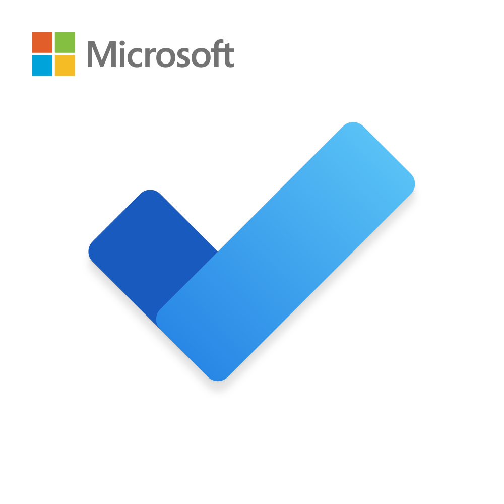
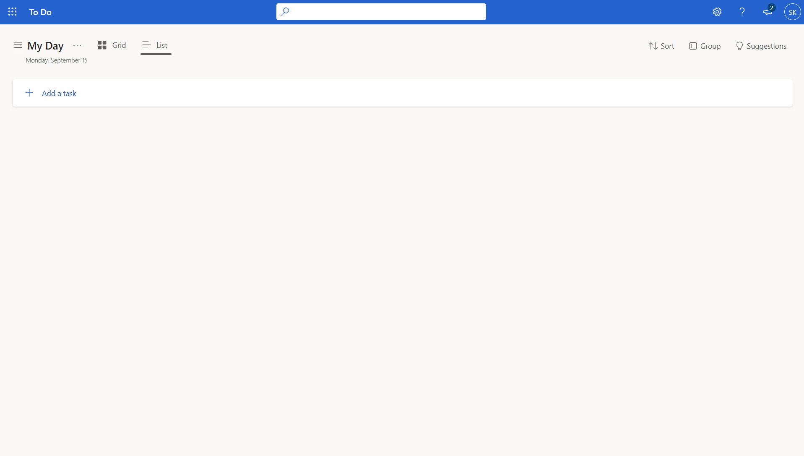
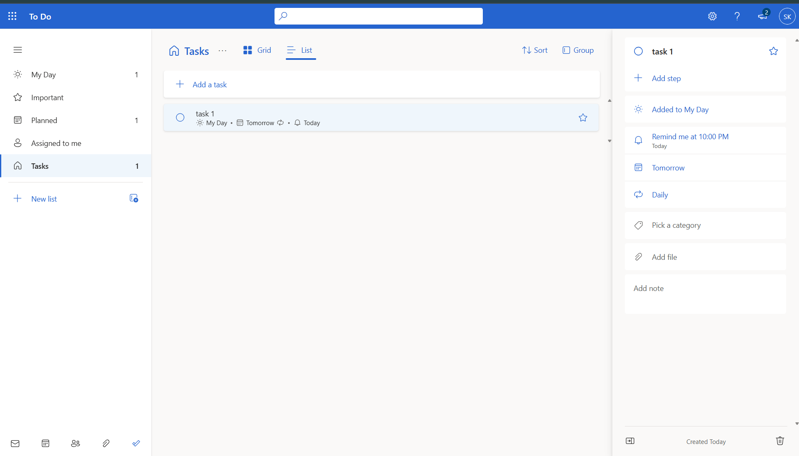
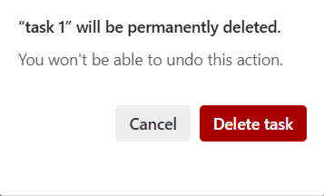
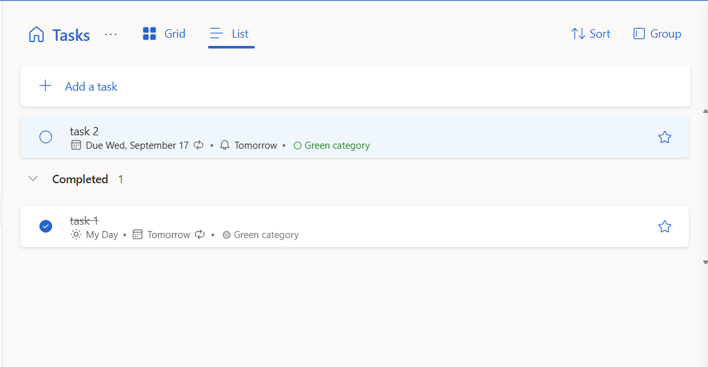
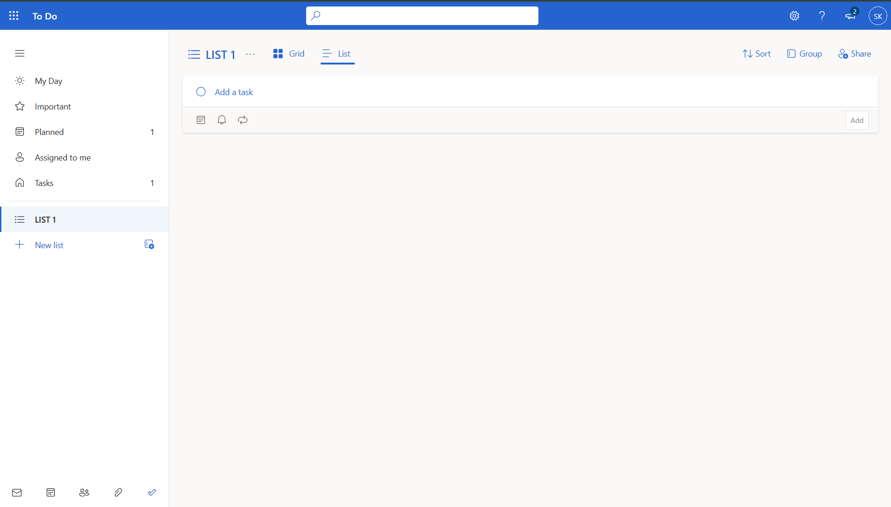
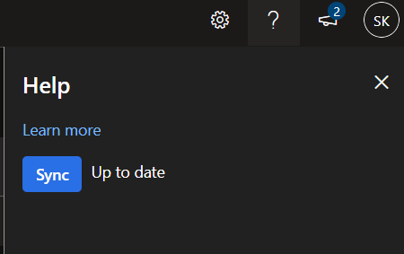
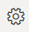
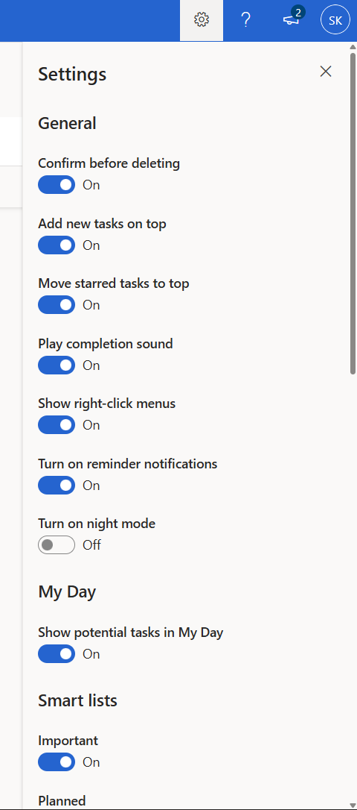
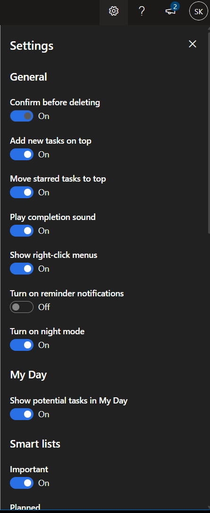

> **Title:** Microsoft To Do – User Manual
> **Author:** Saumil Khanna  
> **Last updated:** 2025-09-02  
> **Version:** 1.0  

# Microsoft To Do – User Manual

## Introduction
A comprehensive guide about Microsoft To Do and its features for an Individual.  

## Getting Started
- Access to Internet
- Navigate to [Microsoft To Do](https://to-do.office.com/tasks/)
- Login using your Microsoft Account or Signup using a new Account at [Create your Microsoft account
](https://signup.live.com/signup?sru=https%3a%2f%2flogin.live.com%2foauth20_authorize.srf%3flc%3d1033%26client_id%3d3ff8e6ba-7dc3-4e9e-ba40-ee12b60d6d48%26mkt%3dEN-US%26opid%3d93089D92E33410F5%26opidt%3d1757974707%26uaid%3d01994f74c5007758ad1ff6f696f36384%26contextid%3d8B783430303111EC%26opignore%3d1&mkt=EN-US&uiflavor=web&lw=1&fl=easi2&client_id=3ff8e6ba-7dc3-4e9e-ba40-ee12b60d6d48&uaid=01994f74c5007758ad1ff6f696f36384&suc=3ff8e6ba-7dc3-4e9e-ba40-ee12b60d6d48&fluent=2&lic=1)

## Main Features

### Create a task
1. Select **Add task** on the main view.
   
2. Enter a task name and press **Enter**.
3. Select **Add due date** and choose a date (optional).
   
4. Select **Remind me** to set a reminder (optional).
   
5. Select **Repeat** to set a recurrence (optional).
   
(screenshots\repeat.png)
### Edit a task
1. Select the task to open the details pane.
   
2. Update any of the following:
   - **Rename**
   - **Add step**
   - **Reminder**
   - **Due date**
   - **Repeat**
   - **Category**
   - **Add file**
   - **Notes**
   - Toggle **Important** (star)

### Delete a task
1. Right-click the task and select **Delete task**.
   
2. Confirm in the dialog.

   
 
 
### Mark a task complete
1. Select the circle next to the task name.
2. The task moves to **Completed** and appears struck through.
   

### Create a list
1. Select **New list** in the left pane.
   
2. Add tasks to the list or move existing tasks into it.

## Additional Features
### Sync across devices
1. Open **Help & feedback**.
2. Select **Sync**.
   

### Notifications
1. Open **Settings**.
   
2. Turn on **Reminder notifications**.
   

### Theme
1. Open **Settings**.
2. Turn on **Dark mode**.
   

## Troubleshooting
### Troubleshooting
**Problem:** Can’t sign in  
**Possible cause:** Account or network issue  
**Solution:** Use Microsoft’s [sign-in helper tool](https://go.microsoft.com/fwlink/?linkid=2214157).

**Problem:** 503 error in web app  
**Possible cause:** Local or corporate network restrictions  
**Solution:** Try a different network or VPN. If on corporate network, contact IT.

## Related Links
+ [Microsoft To Do support](https://support.microsoft.com/en-us/todo)
+ Microsoft To Do Download links:
    + [Windows](https://go.microsoft.com/fwlink/?linkid=2135654)
    + [IOS](https://go.microsoft.com/fwlink/?linkid=2135821)
    + [android](https://go.microsoft.com/fwlink/?linkid=2135820)    
+ [Tips & tricks for Microsoft To Do](https://support.microsoft.com/en-us/office/tips-tricks-for-microsoft-to-do-a6b98b37-5b16-496e-838f-9462a05984f4)

## Contact/Support
to Contact Microsoft support click on this [link](https://support.microsoft.com/en-ca/contactus) 

---
**Document Owner:** Saumil Khanna  
**Review Cycle:** Every 6 months  
**Feedback:** Please report issues or suggestions to saumil.khanna@example.com  
---
